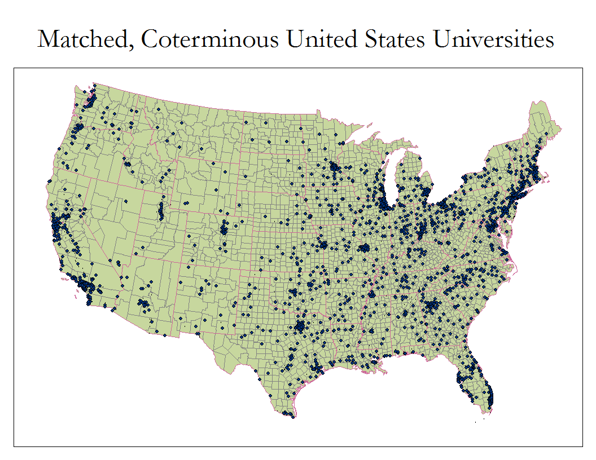
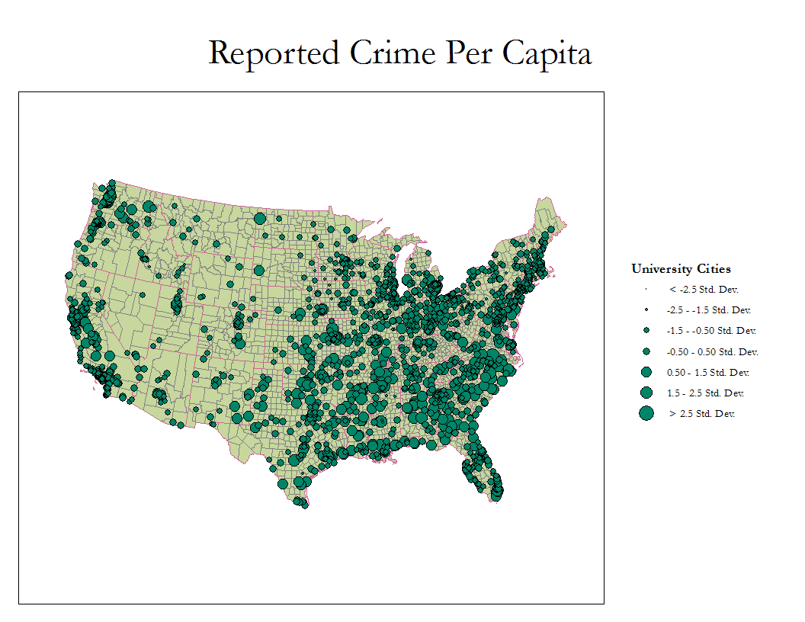
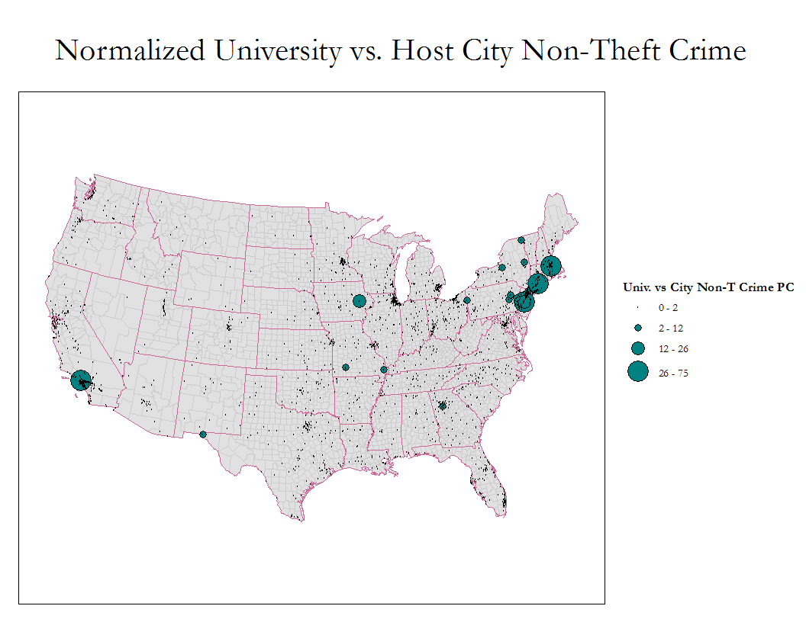
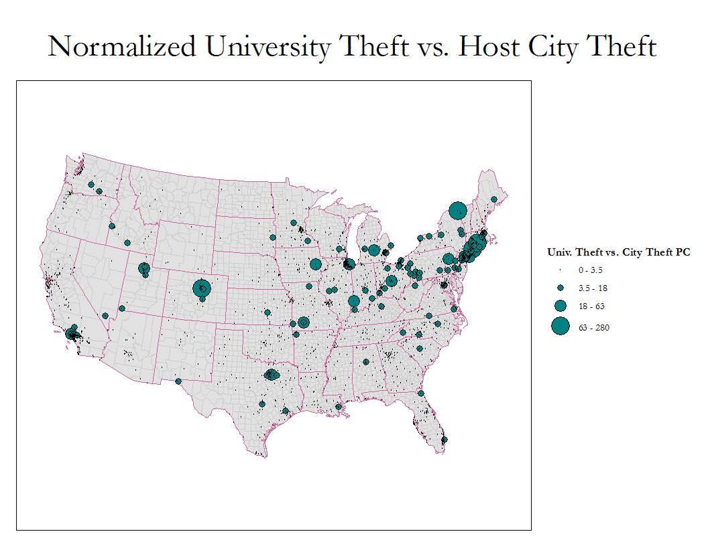

_This report was for an introduction to GIS course so the methodology, rather than the somewhat dubious results, is the important part._

# Introduction & Background

Title IX of the 1972 Education Amendments guarantees that

> No person in the United States shall, on the basis of sex, be excluded from participation
> in, be denied the benefits of, or be subjected to discrimination under any education 
> program or activity receiving federal financial assistance.

In the spirit of Title IX reforms, the 101st US Congress passed the 1990 "Jeanne Clery Disclosure of Campus Security Policy and Campus Crime Statistics Act" requiring all Title IX institutions to disclose statistics about crime on and near their campuses, or otherwise face financial penalties.
Public demand for the Clery Act emerged after the lurid rape and murder of Jeanne Clery sparked outrage towards the perverse incentive university administrators have to _not_ disclose crime on campus [@clerystory], the idea behind non-disclosure being that without the requirement for every university to disclose crime information, for a single school to do so would decrease enrollment and the perception of a school.
But in addition to cases like _Durate v. State_ and _Peterson v. San Francisco Community College District_, Clery's case reinforced the opintion that there is a special guardianship role of a university: "the court decided that the duty of care was owed not only under traditional tort rules but also because the relationship [between student and university] was more than the special landlord-tenant relationship." [@fisher1998]

Sociologist Barry Glassner argues that stories like Clery's are tragic, but symptomatic of a larger problem of media exacerbating particularly scandalous news items for ratings, in the process creating a "culture of fear." [-@glassner1999]
Clery's story sparked a movement that eventually led to the statistical quantification of crime and how dangerous a particular campus could be.
Universally requiring universities to be accountable, work towards gender equality, and guarantee student safety are ideals to strive for when investigating potential universities.
However since the enactment of the Act, crime in the United States in general and on campus has been on an unmistakable downwards trend; "research has shown that the trend in reported violent crime on campus is downward. From 1974 to 1991, the rate of violent crime on campus decreased steadily by 27 percent, from 88 to 64 incidents per 100,000 students." [@fisher1998]
As Glassner points out, however, the rise of the 24/7 news cycle and online communication have made the public "feel" more afraid of crime than ever before.

A particularly damning instance of a culture of fear is the recently retracted frontpage article about an alleged gang rape at the University of Virginia (UVA) campus as part of a fraternity rite of initiation. [@rapeoncampus]
After a cursory independent investigation into the facts of the article determined that the more carnal aspects of the story were entirely fabricated.
The publication of the article was a "failure encompassing reporting, editing, editorial supervision and fact-checking." [@cjr2015]
So then why was the article published?
It feeds into the concerns of worried parents and university administrators who want to appear "tough on crime"; it certainly helped sales of _Rolling Stone_ copies; it fuels concerns of an overly violent society.
But at the end of the day, the story was fabricated!
"This was not wild, psychotic, delusional, or evil fabrication. This was a magazine letting itself slip into temptations that are there all the time and that we have to resist all the time. It was, in some ways, a more chilling account." [@sexassaultpod]
If anything, the UVA story reinforces the need for quantiative statistics, thoroughly investigated and reported.

***

Statistics can lie, however.
The role of numbers as unreliable narrator comes from their origination as self-reported data.
For historical precendent, we can turn to the New York City Police Department's Complaint Statistics (CompStat) software.
Part of a Geographic Information System (GIS) designed to map crime, identify problem areas, and effectively "predict" and reduce crime based on past crime information, the system is only as reliable as the data that is fed into it.
The data comes in from precincts and is often artificially positive, i.e. ignores some arbitrary crimes to make policing policies seem more effective.
@eterno2012 argue that this fudging of the supposed inviolable facts is inevitable in any situation, saying "The more any quantitative social indicator is used for social decision-making, the more subject it will be to corruption pressures and the more apt it will be to distort and corrupt the social processes it is intended to monitor."

So with the example of CompStat in mind, @sloan1997 list five crucial limitations of the Clery Act that need to be considered in any analysis.

1. Limited jurisdictional focus of the statistics

First, the data cannot accurately describe all crime that happens to students. Instead, it describes incidents depending on their occurrence in residence halls, public property, on-campus, and non-campus. So if a large amount of incidents happen off-campus and are not reported to the university then the data is misleadingly positive.

2. Victim-reporting practices resulting in underestimates of the volume of crime

Notoriously, it is known that self-reported data **severely** understates the real amount of crime:

> Reporting levels for commonly occurring crimes (e.g., personal larceny without contact, vandalism, harassments) ranged from about 23% for personal larceny without contact to 28% for vandalism.
> Low reporting levels also were found for most of the crimes for which the act requires statistics to be gathered.
> For example, only 22% of the rapes and 18% of the sexual assaults were reported, none of the robberies was reported, 50% of the aggravated assaults were reported, and 25% of the burglaries were reported.
> One exception to this pattern was automobile theft, for which all of the victimizations were reported.

The primary reason for such dismal reporting rates is a feeling of helplessness that reporting would make any difference; the victim's desire to move on trumping the desire to inform future students: "only between 55% and 66% of on-campus victims reported their victimizations to campus [...] victims were unwilling to report their victimizations to campus police because they perceived that the latter were 'unable to do anything' about the crimes." In total, "only 25% of all victimizations were reported to any authority." [@sloan1997]

3. Exclusion of certain offenses from the list of crimes for which data are to be gathered

The Clery Act data follows the Federal Bureau of Investigation's (FBI) lead in categories in which data is reported; as a result, the Act "focuses almost exclusively on personal crimes of violence (e.g., aggravated assault) and overlooks theft-related crimes (e.g., personal larceny)" [-@sloan1997] which are not considered in the FBI's list of priority offenses.

4. An overemphasis on "crimes of high concern"

Returning to the ease in which it is to publicize especially scandalous stories, the overemphasis on crimes such as rape and murder overshadow less sensational, but arguably more dire trends in offenses. @fisher1995 found that "the on-campus rape rate is similar to the off-campus rate, but the on-campus sexual assault rate is 1.4 times higher than the off-campus rate. Furthermore, compared to the on-campus rate, the aggravated assault rate off campus was 4.5 times higher. The simple assault rate, however, was less than twice as high (1.5) as the on-campus rate. Students were more likely to experience a theft on campus; the rate was 2.1 times higher than the off-campus rate."

5. Potential misuses of the statistics by consumers in making judgments about the relative safety of college and university campuses.

The original impeteus for the Clery Act was to provide information to let individual students and families to decide whether or not a school could provide a sufficiently safe environment to learn.
So it is then somewhat ironic that the methods and types of data collected so far do not really accomplish this ideal, as rigorously shown by Fisher and Sloan as well as many others.
In terms of personal safety and the safety of the environment a student could expecte to be in, the data does not elucidate much.
It is really in the theft statistics that the Act provides clear guidance:

> The location of the campus (urban or rural), the unemployment rate in the school’s SMSA, and the population size of the community in which the campus was located were not significantly correlated with campus crime rates. [...]
> Crime rates for the community in which the campus was located had little impact on campus crime rates. [...]
> However, higher rates of motor vehicle theft and robbery on campus were associated with higher rates in the community. [@fisher1995]

If we look at intra-university crime statistics, we see that "close to 80% of victimizations committed against students were by fellow students."
If we look specifically at incidents of theft, we see that "theft victimization [...] reflects the general perception among students that they are not at risk for victimization and their failure frequently to take rudimentary steps to protect their property-such as locking the door to their room or asking another student to 'keep an eye on' their property." [-@fisher1995]
So then, it seems that it is not a matter of the "nature" of surroundings, but that it is the "nuture" of how students perceive their environment that causes crime.
Indeed, one might argue that overconfidence in (_severely underreported_) crime statistics could be the main factor in causing crime in the first place!

***

In this research project we will attempt to recreate the trends in the literature.
Mainly, the overall idea that trends in theft on-campus **do correlate** to trends in theft in the community at large, and that per capita, universities have lower incidences of crime (or at least lower reported incidences of crime) than the general public.

# Research Questions

We now formulate **two** specific research questions based on the literature presented:

1. On a micro level, we will investigate our data methodology and approach by looking at the campuses in Miami and Coral Gables, Florida. We want to observe if we can obtain reliable trends in data based on joining a campus to its surrounding city.

2. On a macro level, are campuses "ivory towers", i.e. do campuses have demonstrably lower rates of crime than their surrounding areas?

We speculate that universities overall are situated in areas of medium- and high-income---as a result, they have better public services like policing and are thus safer.
@fisher1995 say that we should not expect a strong correlation, i.e. we expect this question to be answered in the negative.
As best as possible, we will try to recreate the positive correlation between auto theft/robbery rates on-campus to in-community rates.

# Data Methodology

Due to different data sources, publishers, and online availability, we have data that is not consistent in terms of temporal range or spatial range. 

## Temporal Range Challenges

Because some of the datasets we need are run on school year cycles or decadal cycles, finding overlapping data is difficult.
We opt for taking data for 2010, 2011, and 2012.

- 2010 US Census Data included in the `mgisdata` folder
- 2012 Clery Act Data, covering the years 2010-2011 [@clerydata]
- 2012 UCR Data [@ucr2012]

## Spatial Range Challenges

- UCR Data: State and County Federal Information Processing Standards Codes (FIPS)
- Clery Data: Street Name, City Name, State Abbreviation, and Zip Code (Zip Code+4 sparingly)
- ACS Data: Combined State/County FIPS; County and State Names

Ideally, we would have polygon shapefiles for campuses and points where each crime was reported to have happened.
However, to compensate for the lack of resolution, we need an alternative system.
Thus, we do much of our analysis based on cities.
We first join crime data for a county to all of the points inside of it. (A flaw in this approach is if there are more than one city in a county---this requires an unaccounted for division.)
Then, we join universities to the city in which they belong with a geocoder running off of City and State fields.
For those universities that do not have the required data to do these joins, we simply discard them with the rationalization that they are small outliers.
Indeed, we successfully match about 75% of the universities using this simple geocoding/city approach.

## Data Pre-processing

0. Download all data files.

In some cases like the ACS, this involves use of an interactive data slicing tool, so there is not an easy way to deterministically link to the source of the data set.
Irrespective of source, these files come as `.zip` files.

1. Convert data sets to a common data format: `.xls`

    * UCR

    Using the `.pdf` codebooks included in the distribution of the datasets, we converted the `.txt` file to an `.xls` file.
    Doing so was easy since each line represented a single FIPS county district, and each line corresponded to a fixed-width arrangement of data.
        
    * Clery

    The Clery data is already in `.xls` format.
    But, each year has six to twelve files to represent the data for the school year in question with names like:

    1. Residencehallarrest
    2. Residencehallcrime
    3. Residencehallhate
    4. Oncampusarrest
    5. Oncampuscrime
    6. Oncampushate

    We simply opt to use `Oncampusarrest.xls`.

3. Import each year as a separate layer into ArcGIS

# Known Data Methodology Limitations

- Short time frame

As Mao Zedong illustrated, sometimes five years just isn't long enough.
To ensure we have durable long-term trends instead of quirks in reporting or university administration policies, it would be useful to have a larger temporal range to look at. 
In an effort to reduce on complexity and possible errors, we stick with just one year.

- Estimation of campus size and location is unreliable

Universities can vary tremendously in terms of acreage and student enrollment.
We have data for enrollment and we can extrapolate acreage if we assume they are linearly correlated.
But if would simply be easier and involve fewer assumptions if we had ArcGIS polygons of the campuses detailed in the Clery Data.
For now, we normalize our data based on enrollment figures.

Additionally, campuses might span multiple counties, or counties might have crime concentrated in far-flung corners of their boundaries. With reliable polygon data, we could investigate these trends with confidence, but for now we stick with the assumption that campuses are a single point at the best-guess geocoded address and that the campus boundaries do not cross out of this county. (This assumption is fairly reasonable---by sticking to one county, the institution has a far easier time with management with civil services.)

- Possible double-counting in UCR statistics

Depending on how the crime was reported, it might show up in the county-level crime data or it might stop at the local campus police. There is no reliable way of discerning if this double-counting occurred.

- Uncontrolled variables

Sociological factors in the reporting of crime make it hard to do an apples-to-apples comparison of different universities.
However, we assume that a single university can be compared with its historical data for an effective comparison based on "campus culture."

\newpage

# Analysis and Results

## Research Question 1

Our first question is an investigation of the thoroughness of our methodology and ideas to be aware of in later analysis.
Prior to this question, we have already geocoded and done some basic cleanup of data to cut the Clery data down by about 25%.
The remaining 75% is accurately coded and has mostly non-null values.
As a result of small universities, a large majority of the crime data are completely zero.

In addition to the geocoding, we also calculate 12 fields for crime, non-theft crime (total crime less theft crime), and theft crime (robbery, auto vehicle theft, burglary) on- and off-campus, those numbers adjusted per capita (total enrollment for universities; 2010 US Census population for cities).

For this question in specific, we start by doing a `Select by Attributes` for geocoded university addresses in Florida with city names like `Miami` or `Coral Gables` (a `LIKE` rather than a straight equality because the Clery data has very inconsistent capitalization throughout).
We then get 63 universities that report Clery Data.
For this case study, we look at only four of those representing the different kinds of data we can expect.

### Unadjusted University Crime Data

INSTNM                  CRIMALL CRIMNONTFT  CRIMTFT 
----------------------- ------- ----------  ------- 
Barry University	    21	    0	        21
University of Miami	    78	    6	        72
FIU	                    210	    18	        192
ITT Technical Institute	0	    0	        0

Looking at the unadjusted crime statistics, we see some of the truth of @sloan1997.
In the first three institutions, we see that crime is apparently a _huge_ issue at FIU, but this is pretty reasonable since it has a huge enrollment.
We also see that theft crimes far dominate the statistics.
Finally, we see that it is very possible for a small, commuter trade school like ITT does not have any data to report; really, many of the classes are probably taken online anyway so zeros gel with our intuition.

### Adjusted University Crime Data Per Capita

INSTNM                  CRIMALLPC   CRIMNONTFTPC    CRIMTFTPC
----------------------- ---------   ------------    ---------
Barry University	    0.0024	    0.0000	        0.0024
University of Miami	    0.0049	    0.0004	        0.0045 
FIU	                    0.0047	    0.0004	        0.0043
ITT Technical Institute	0.0000	    0.0000	        0.0000

Now we look at the numbers adjusted for the size of the total student population.
Now, rather than FIU having the largest apparent problem, we see that UM has the most crime per capita for our four institutions.
A possible explanation for this data is the large commuter population of FIU or simply differences in reporting standards.

### Unadjusted Surrounding City Crime Data

INSTNM                  CTYCRIMALL  CTYCRIMNONTFT   CTYCRIMTFT
----------------------- ----------  -------------   ---------- 
Barry University	    130943	    94381	        36562
University of Miami	    130943	    94381	        36562
FIU	                    130943	    94381	        36562
ITT Technical Institute	130943	    94381	        36562

As a fragment of our join-to-city approach, every row has identical data, data for Miami-Dade County.
Here we see the caveat we mentioned earlier: Miami-Dade county is very large, encompassing Miami and Coral Gables as well as smaller jurisdictions.
A simple linear split with respect to population per square unit of area might suffice.

### Adjusted Surrounding City Crime Data Per Capita

INSTNM                  CTYCRIMALLPC    CTYCRIMNONTFTPC CTYCRIMTFTPC
----------------------- ------------    --------------- ------------
Barry University	    0.0531483628	0.0383082367	0.0148401242
University of Miami	    0.0531483628	0.0383082367	0.0148401242
FIU	                    0.0531483628	0.0383082367	0.0148401242
ITT Technical Institute	0.0531483628	0.0383082367	0.0148401242

Again, all these rows have the same data.
Interestingly, the rate of crime seems to be an order-of-magnitude larger, about 10x.

### Question 1 Conclusion

For this quick analysis, the answer to the question is yes, we can get meaningful data and conclusions out of our data methodology.
However, a more thorough analysis should have a finer resolution target to join to, perhaps incorporating the detailed, if unformatted, address information in the data.

## Research Question 2

For our second question, we turn to a series of maps to investigate the "ivory tower" phenomenon.
These maps focus on the coterminous United States for presentation reasons.
In addition, we use an equidistant projection, but opt to not include a scale bar or compass arrow intentionally.
Since we focus on the coterminous US from the same zoom, we focus mainly on the size of symbols, not on their distance apart.

First, we see the available data points. Clusters of universities exist along the east coast, especially in Florida and New England. 
Additionally there seem to be clusters around Texas's and Illinois's metropolitan areas.
Finally, on the west coast we have clusters in Washington, Oregon, and California.
Also, we observe that there are very few black specks unaccompanied by a blue dot---this result means that universities usually coincide with large cities.

To get a better idea of the total number of students actually served, we simplify the previous map to one of states based on a summarized version of the University layer with respect to states and the `Total` field of the Clery data.
By chunking the summarized join into four roughly equal intervals, we see that California, Florida, and Texas have the most university students---hardly surprising, since these are the three most populous states.
But this does illustrate that university density **does not imply** a large student density and thus does not imply a high crime density.

\newpage

Now we turn to Figure 3.
Here we have a map of all of the reported crimes in a city with a university, adjusted to account for the 2010 population of that city.
We chose a standard deviation classification because the data was very normally distributed in an unbiased bell curve.
We can infer from the bell curve and the map illustrated that the crime rate is a very complex issue that effectively might as well be randomly generated.

\newpage

Finally, we compare our rates for all crimes per capita between the unversity and the city.
In more unambiguous terms, this map illustrates the ratio between the columns `CRIMALLPC` and `CTYCRIMALLPC` from the tables above.
From here on we opt for a (4) Jenks Natural Break where most of the observations are concentrated in the lower classifications.

We can draw the following conclusions from this map:

1. The majority of high crime institutions appear to be in the Northeast region.
2. Scattered medium crime institutions appear in the Midwest region.
3. The Los Angeles region is also a high-crime area.

It seems improbable that there is a university where for every 1 crime committed in its host city, 110 crimes happen on-campus!
More than likely, this is a fragment of over-reporting a large crime ring, not some deranged shooter.
Although such an incident does justify the need for a more averaged statistic.

In general, this map seems to back the claim that reporting practices are inconsistent at best.

\newpage

Now we turn to the first sub-component of crime, non-theft crime like arson, assault, murder, or rape.

Here we see a more focused grouping around the major cities of New York, Boston, and Los Angeles.
Important to note is that this statistic is still normalized to be a per capita ratio.
A potential explanation for this phenomenon is the free-form nature of what the campus proper is in these areas.
Assuming that these areas are very walkable and that the universities are spread out across multiple buildings incorporated into the urban surroundings, it follows that there is less of a "tight-knit community" of students.
Further work, perhaps incorporating walkability metrics, would be valuable to confirm this hypothesis.

\newpage

Here we see the other (major) sub-compoent of the crime data, theft crime like robbery, burglary, and automotive theft.
The data here is much more evenly spread out, implying that theft is a somewhat universal problem and that it only takes a few enterprising thieves to put your institution on the crime map---see upstate New York for a shining example.
The even distribution of the data implies that this category of crime is well-reported and also a problem in campuses across the county, regardless of enrollment size.

### Question 2 Conclusion

So, are universities "ivory towers," utopian paradises without crime?
Obviously, no.
It bears repeating that the belief in the paradise might be what causes so much crime as students let their guards down since the "general perception among students that they are not at risk for victimization."
Furthermore, we observed that theft is extremely prelevant across the country.

I believe the parents of Jeanne Clery would not be disappointed with these results
Now improvements in awareness of theft and programs to increase reporting rates are the next step.

\newpage

# References
